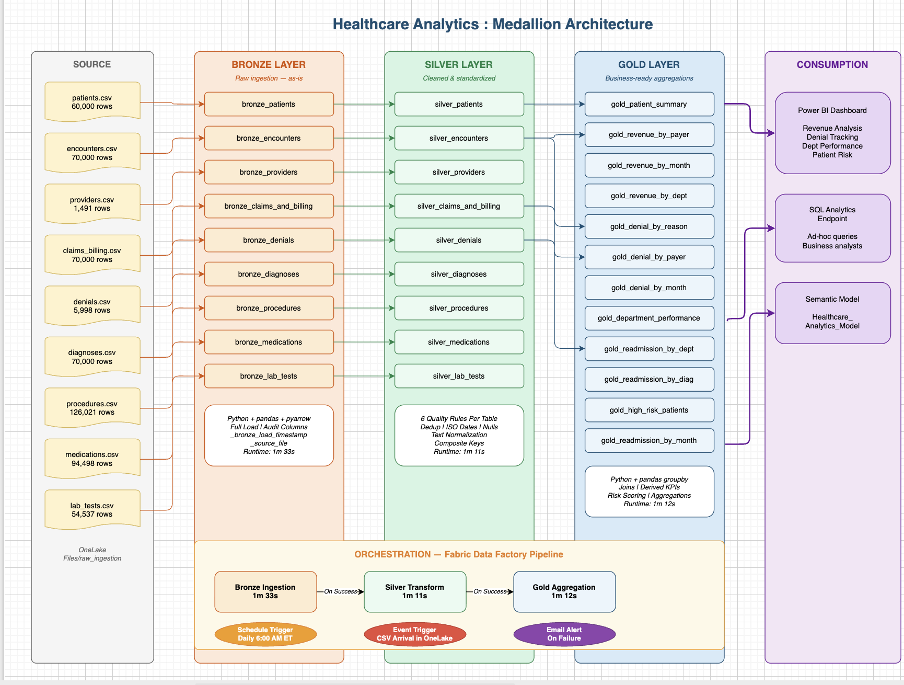
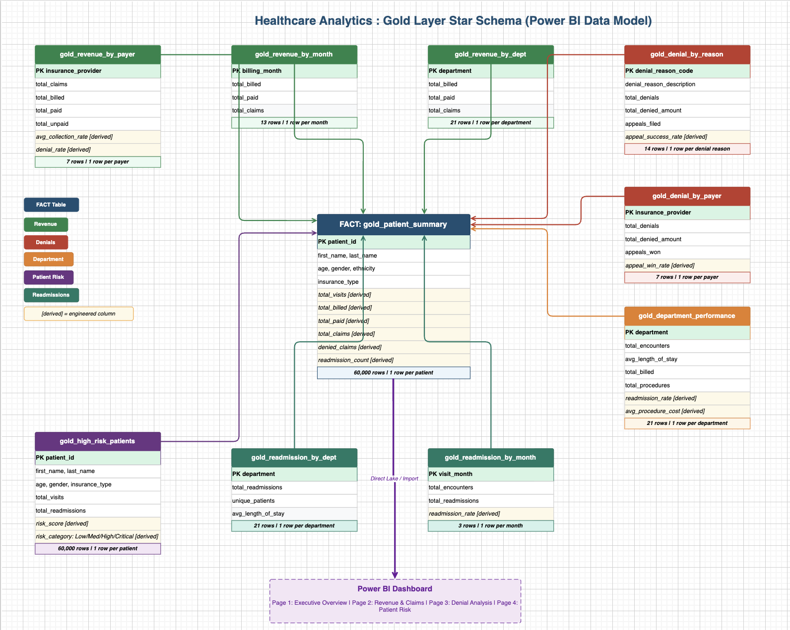

# 🏥 Cloud Data Engineering Platform | Microsoft Fabric

[](https://fabric.microsoft.com)
[](https://python.org)
[](https://powerbi.microsoft.com)
[](https://azure.microsoft.com/products/devops)
[](https://parquet.apache.org)
[](https://learn.microsoft.com/en-us/fabric/data-warehouse/sql-analytics-endpoint)
[](https://learn.microsoft.com/en-us/fabric/onelake/onelake-overview)

End-to-end healthcare data engineering platform built on **Microsoft Fabric** with a production-inspired Medallion Architecture, orchestrated with **Fabric Data Factory**, promoted through a full **CI/CD deployment pipeline** (Dev → Test → Prod), and surfaced in **Power BI** dashboards.

This solution processes 552,545 rows across 9 clinical and financial source files, delivering executive-ready dashboards covering revenue cycle, denial management, department performance, and patient risk scoring.

---

## 📚 Table of Contents

- [📋 Overview](#-overview)
- [🏗️ Architecture](#️-architecture)
- [🛠️ Tech Stack](#️-tech-stack)
- [📊 Datasets](#-datasets)
- [🥉 Bronze Layer](#-bronze-layer)
- [🥈 Silver Layer](#-silver-layer)
- [🥇 Gold Layer: Star Schema](#-gold-layer-star-schema)
- [⚙️ Orchestration](#️-orchestration)
- [📈 Analytics Consumption Layer](#-analytics-consumption-layer)
- [📊 Dashboards](#-dashboards)
- [🔄 DevOps & CI/CD](#-devops--cicd)
- [💡 Key Engineering Decisions](#-key-engineering-decisions)
- [📊 Business Insights](#-business-insights)
- [🔧 Troubleshooting: Composite Key Discovery](#-troubleshooting-composite-key-discovery-in-silver)
- [🔮 Production Enhancements](#-production-enhancements)
- [👤 Author](#-author)

---

## 📋 Overview

- **Microsoft Fabric Lakehouse** as the unified storage and compute layer (OneLake)
- **Python + pandas + pyarrow** for notebook-based data transformation
- **Fabric Data Factory** for pipeline orchestration, scheduling, and event-based triggers
- **Parquet** as the storage format across all medallion layers
- **Power BI** semantic model and dashboards connected via the SQL Analytics Endpoint
- **Azure DevOps + Fabric Deployment Pipelines** for source control and CI/CD across Dev → Test → Prod

### Project Highlights

- Built a production Medallion Architecture (Bronze / Silver / Gold) on Microsoft Fabric
- Automated orchestration with a chained notebook pipeline (On Success dependencies)
- Dual-trigger strategy: daily schedule (6:00 AM ET) + event-based CSV arrival trigger
- Email failure alerts configured directly in the pipeline
- Composite key deduplication discovered and resolved through data profiling
- Engineered derived KPIs: collection rate, unpaid amount, risk score, readmission rate
- Designed a star schema for Power BI with 1 fact table and 11 dimension aggregates
- **Built CI/CD with Azure DevOps Git integration and Fabric Deployment Pipelines (Dev → Test → Prod)**
- **Built a Power BI semantic model and dashboards for revenue cycle, denials, department performance, and patient risk**
- Full pipeline runtime under 4 minutes end-to-end

### Business Value

Healthcare organizations face significant revenue leakage due to denied claims, delayed reimbursements, and inconsistent payer processing. This platform centralizes clinical and financial data into a governed analytics environment to provide:

- Visibility into denial trends and appeal success rates
- Insurance payer revenue and collection rate analysis
- Department-level readmission and performance tracking
- Patient risk scoring for clinical intervention prioritization
- Executive-ready reporting via Power BI

---

## 🏗️ Architecture



---

## 🛠️ Tech Stack

| Layer                   | Technology                              | Purpose                                        |
| ----------------------- | --------------------------------------- | ---------------------------------------------- |
| Platform                | Microsoft Fabric                        | Unified lakehouse + compute + BI               |
| Storage                 | OneLake (Lakehouse)                     | Medallion layer storage                        |
| Compute                 | Fabric Notebooks (Python kernel)        | Data transformation                            |
| Libraries               | pandas, pyarrow, pyarrow.parquet        | DataFrame processing and Parquet I/O           |
| File Format             | Apache Parquet                          | Typed, compressed columnar storage             |
| Orchestration           | Fabric Data Factory                     | Pipeline sequencing and scheduling             |
| Triggers                | Schedule + Event-based (OneLake)        | Batch and near real-time refresh               |
| Alerting                | Email failure notifications             | Pipeline monitoring                            |
| Semantic Model          | Power BI (SQL Analytics Endpoint)       | `healthcare_gold_model` star-schema model      |
| Visualization           | Power BI                                | Executive dashboards                           |
| Version Control & CI/CD | Azure DevOps + Fabric Deployment Pipelines | Git integration, PR workflow, Dev → Test → Prod promotion |
| Diagramming             | draw.io                                 | Architecture and data model diagrams           |

> **Note on Spark:** HTTP 430 throttle errors on a Fabric trial account blocked Spark compute during the build. The pipeline was intentionally redesigned using pure Python (pandas + pyarrow) to deliver a tested, working solution — a real production decision-making exercise. In a production environment, Bronze and Silver would use PySpark for distributed scale, and Gold tables would be written as Delta format to enable the SQL Analytics Endpoint natively.

---

## 📊 Datasets

| Dataset              | Rows        | Key Columns                                                  |
| -------------------- | ----------- | ------------------------------------------------------------ |
| patients             | 60,000      | demographics, city, state, insurance_type                    |
| encounters           | 70,000      | visit_date, visit_type, readmitted_flag, length_of_stay      |
| diagnoses            | 70,000      | diagnosis_code, chronic_flag, primary_flag                   |
| claims_and_billing   | 70,000      | billed_amount, paid_amount, claim_status                     |
| denials              | 5,998       | denial_reason_code, appeal_status, final_outcome             |
| procedures           | 126,021     | procedure_code, procedure_cost                               |
| medications          | 94,498      | drug_name, dosage, cost                                       |
| providers            | 1,491       | specialty, department, npi                                    |
| lab_tests            | 54,537      | test_name, test_result, status                               |
| **Total**            | **552,545** |                                                              |

---

## 🥉 Bronze Layer

**Notebook:** `01_bronze_ingestion.ipynb`
**Path:** `Files/bronze/{table_name}/part-0.parquet`

The Bronze layer is the **raw landing zone**. No transformations, no business logic — read the CSV and land it safely with two audit columns added.

```python
for table_name, file_name in SOURCE_FILES.items():
    df = pd.read_csv(f"{RAW_PATH}/{file_name}")

    # Audit columns — WHEN and WHERE the data came from
    df["_bronze_load_timestamp"] = datetime.now().isoformat()
    df["_source_file"]           = file_name

    # Write as typed, compressed Parquet (vs raw untyped CSV)
    pq.write_table(
        pa.Table.from_pandas(df),
        f"{BRONZE_PATH}/{table_name}/part-0.parquet"
    )
```

**Why Parquet over CSV?** Parquet stores column types (int, float, datetime), compresses automatically, and reads 5–10x faster. Every byte written in Bronze is read multiple times downstream — format choice compounds.

**Why audit columns?** In production, data lineage and compliance require knowing *when* each row arrived and *from which file*. These columns are available for debugging and watermarking.

**Total: 552,545 rows loaded in 1m 33s.**

---

## 🥈 Silver Layer

**Notebook:** `02_silver_transformation.ipynb`
**Path:** `Files/silver/{table_name}/part-0.parquet`

Silver applies **6 quality rules per table**: deduplication, ISO date parsing, null handling, text normalization, derived column engineering, and audit column management.

```python
# Example: silver_patients
df = pd.read_parquet(f"{BRONZE_PATH}/patients/part-0.parquet")

# Rule 1 — Deduplication on primary key
df = df.drop_duplicates(subset=["patient_id"])

# Rule 2 — Parse dates to ISO format
df["dob"]               = pd.to_datetime(df["dob"], dayfirst=True, errors="coerce")
df["registration_date"] = pd.to_datetime(df["registration_date"], dayfirst=True, errors="coerce")

# Rule 3 — Text normalization (prevents "MALE" vs "Male" fan-out in Power BI)
df["gender"]         = df["gender"].str.strip().str.title()
df["insurance_type"] = df["insurance_type"].str.strip().str.upper()

# Rule 4 — Null handling
df["phone"] = df["phone"].fillna("Unknown")

# Rule 5 — Silver audit column; drop Bronze audit columns
df["_silver_load_timestamp"] = datetime.now().isoformat()
df = df.drop(columns=["_bronze_load_timestamp", "_source_file"])
```

**Derived columns engineered at Silver (claims_and_billing):**

```python
df["unpaid_amount"]   = df["billed_amount"] - df["paid_amount"]
df["collection_rate"] = (df["paid_amount"] / df["billed_amount"] * 100).round(2)
```

These metrics are calculated once in Silver and reused across multiple Gold aggregations without redundant computation.

**Runtime: 1m 11s.**

---

## 🥇 Gold Layer: Star Schema

**Notebook:** `03_gold_aggregation.ipynb`
**Path:** `Files/gold/{table_name}/part-0.parquet`



All 9 Silver tables are loaded into memory, joined, grouped, and written to 12 business-ready aggregation tables.

| Table                         | Rows   | Business Use                                                 |
| ----------------------------- | ------ | ----------------------------------------------------------- |
| `gold_patient_summary`        | 60,000 | Central fact — total visits, spend, readmissions per patient |
| `gold_revenue_by_payer`       | 7      | Revenue and denial rate per insurance company                |
| `gold_revenue_by_month`       | 13     | Monthly revenue trend                                        |
| `gold_revenue_by_dept`        | 21     | Revenue breakdown by department                              |
| `gold_denial_by_reason`       | 14     | Top denial codes and appeal success rates                    |
| `gold_denial_by_payer`        | 7      | Denials per insurance provider                               |
| `gold_department_performance` | 21     | Avg LOS, readmission rate, procedure costs                   |
| `gold_readmission_by_dept`    | 21     | Readmissions by department                                   |
| `gold_readmission_by_diag`    | 63     | Which diagnoses drive readmissions                           |
| `gold_high_risk_patients`     | 60,000 | Risk score and category per patient                          |

### Patient Risk Scoring

```python
# Multi-factor risk score: age, visit frequency, readmissions, chronic conditions
high_risk["risk_score"] = (
    (high_risk["age"] // 10) +                        # older = higher risk
    (high_risk["total_visits"] * 2) +                 # frequent visitors
    (high_risk["total_readmissions"] * 5) +           # readmissions weighted heavily
    (high_risk["chronic_count"].fillna(0) * 3)        # chronic condition burden
)

high_risk["risk_category"] = pd.cut(
    high_risk["risk_score"],
    bins=[0, 10, 15, 20, float("inf")],
    labels=["Low", "Medium", "High", "Critical"]
)
```

**Runtime: 1m 12s.**

---

## ⚙️ Orchestration

**Tool:** Fabric Data Factory — `healthcare_master_pipeline`

The three notebooks are chained sequentially with an `On Success` dependency between each step:

```
bronze_ingestion  ──On Success──▶  silver_transformation  ──On Success──▶  gold_aggregation
     1m 33s                              1m 11s                                 1m 12s
```

**Total pipeline runtime: < 4 minutes**

### Triggers Configured

| Trigger               | Type                 | Configuration                                                |
| --------------------- | -------------------- | ------------------------------------------------------------ |
| `daily_schedule`      | Schedule             | Every day at 6:00 AM ET                                       |
| `csv_arrival_trigger` | Event-based          | Fires on new CSV arrival in `Files/raw_ingestion` in OneLake |
| Email alert           | Failure notification | Failure notifications configured through Fabric alerting     |

The dual-trigger pattern simulates a production scenario where files can arrive ad-hoc between scheduled batch runs, requiring near real-time processing without manual intervention.

---

## 📈 Analytics Consumption Layer

The Gold datasets power:

- A Power BI **semantic model** (`healthcare_gold_model`) built over the Fabric SQL Analytics Endpoint
- Power BI **dashboards** for revenue cycle, denials, department performance, and patient risk
- Fabric SQL Analytics Endpoint for ad-hoc SQL analysis
- Future reporting workloads

The semantic model is source-controlled and promoted through the deployment pipeline alongside the lakehouse and Gold tables (see [DevOps & CI/CD](#-devops--cicd)).

---

## 📊 Dashboards

Dashboards are built on the `healthcare_gold_model` semantic model and refresh from the Gold layer.

### Revenue Cycle & Payer Performance


Total billed, paid, and unpaid amounts with collection rate broken out by insurance payer, department, and month. Surfaces where revenue is leaking and which payers drive the largest unpaid balances.

### Denial Management


Denial rate by reason code, appeal success rate, and denials by payer and month. Highlights high-frequency denial codes and where appeals are winning — a direct process-improvement signal.

### Department Performance


Average length of stay, readmission rate, and procedure costs by department, ranking departments by performance and cost.

### Patient Risk Scoring


Risk-score distribution and high-risk patient counts by category (Low / Medium / High / Critical), plus which diagnoses drive readmissions — used to prioritize clinical intervention.

> Screenshots live in `docs/`. To add or update one, drop the PNG into `docs/` using the filenames above.

---

## 🔄 DevOps & CI/CD

The entire Fabric workspace is source-controlled in **Azure DevOps** and promoted across three environments (**Development → Test → Production**) using **Fabric Deployment Pipelines**. Changes flow through a **branch → pull request → merge** workflow, so `main` always reflects reviewed, working code.

> **Plain-English version:** Fabric is wired to Azure DevOps the same way a Google Doc is wired to version history. Every pipeline, notebook, and lakehouse becomes a file in the repo. I never edit the live copy directly: I branch, make my change, open a pull request, get it reviewed, and only then does it merge and get promoted to Production.

### 1. Source Control — Fabric Git Integration

The Fabric workspace is connected to an Azure DevOps Git repository. Every workspace item is serialized to a folder and versioned automatically:

| Git Folder                          | Fabric Item Type | Role in Pipeline                     |
| ----------------------------------- | ---------------- | ------------------------------------ |
| `Bronze_Pipeline.DataPipeline`      | Data pipeline    | Raw ingestion orchestration          |
| `Healthcare_ingestion.DataPipeline` | Data pipeline    | Metadata-driven ingestion            |
| `DataflowGen2.Dataflow`             | Dataflow Gen2    | No-code Silver transformations       |
| `Silver_layer.Notebook`             | Notebook         | Silver transformation logic          |
| `healthcare_lakehouse.Lakehouse`    | Lakehouse        | OneLake storage (Bronze/Silver/Gold) |

When a notebook is changed in Fabric and committed, Git stores the source as `notebook-content.py`, so notebook logic is diffable and reviewable like any other code, not locked inside a binary.

> **Why it matters:** Serializing Fabric items to Git gives full version history, rollback, and code review on data pipelines and notebooks — the same discipline software teams apply to application code.

### 2. Branching & Pull Request Workflow

`main` is never edited directly. Every change is made on a feature branch and merged through a pull request.

```
main
 └─▶ healthcarebranch1        # feature branch created for a change
        │  add UTC timezone   # commit: switch load timestamps from local time to UTC
        ▼
   Pull Request #1  review──▶  Merge into main   ✅
```

**Example — Pull Request #1: `add UTC timezone`.** Audit timestamps (`_bronze_load_timestamp`, `_silver_load_timestamp`) were originally written in local time and switched to **UTC** on a feature branch, removing ambiguity across regions and daylight-saving changes. The change was committed, opened as PR #1, reviewed, and merged into `main`.

> **Why it matters:** The pull request is a safety gate. A broken change stays on the branch and never touches the production version until it is reviewed and approved.

### 3. CI/CD — Fabric Deployment Pipelines (Dev → Test → Prod)

A **Fabric Deployment Pipeline** promotes the workspace through three isolated environments. Each stage is its own workspace, so untested work never lands in Production.

```
┌───────────────┐      ┌────────────────┐      ┌─────────────────────┐
│  DEVELOPMENT  │  ──▶ │      TEST      │  ──▶ │      PRODUCTION      │
│ Healthcare_Dev│      │ Healthcare_Test│      │Healthcare_production │
│  (build here) │      │   (validate)   │      │   (live workload)    │
└───────────────┘      └────────────────┘      └─────────────────────┘
```

| Stage       | Workspace               | Status                   |
| ----------- | ----------------------- | ------------------------ |
| Development | `Healthcare_Dev`        | Source / build           |
| Test        | `Healthcare_Test`       | ✅ Successful deployment  |
| Production  | `Healthcare_production` | ✅ Successful deployment  |

**Items promoted through the pipeline:** `Bronze_Pipeline`, `Healthcare_ingestion`, `Master_Pipeline`, `healthcare_lakehouse` (+ its SQL analytics endpoint), `Gold_layer`, and `healthcare_gold_model` (semantic model). Before each deployment, Fabric compares the target stage against the source and shows exactly what changed, so nothing is promoted blindly.

> **Why it matters:** This is the CI/CD backbone. Code is built in Dev, validated in Test, and promoted to Prod with a controlled, comparable, one-click deployment — the standard enterprise release pattern.

### Production Maturity Notes

This project demonstrates the full source-control and promotion workflow. A fully hardened enterprise setup would additionally layer on:

| Capability            | What it adds                                                                  |
| --------------------- | ----------------------------------------------------------------------------- |
| Deployment rules      | Rebind lakehouse/data-source connections per stage (Prod reads Prod, not Dev) |
| Branch policies       | Require a reviewer + successful build validation before a PR can merge         |
| Automated validation  | A pipeline that lints notebooks / checks schema on every pull request          |
| Release approval gate | Manual sign-off before promotion to the Production stage                       |

---

## 💡 Key Engineering Decisions

**1. pandas over PySpark — constraint navigated as a production decision.** Spark compute was throttled on a Fabric trial account (HTTP 430 errors). Rather than block the project, the pipeline was redesigned using pandas + pyarrow, with the production path (PySpark for scale, Delta for the SQL Endpoint) documented explicitly.

**2. Composite key deduplication discovered through data profiling.** `diagnosis_id`, `procedure_id`, and `lab_id` appeared to be primary keys but were actually category codes. See [Troubleshooting](#-troubleshooting-composite-key-discovery-in-silver).

**3. Audit columns at every layer.** `_bronze_load_timestamp`, `_silver_load_timestamp`, and `_gold_load_timestamp` carry lineage through each layer, dropped at each transition so only the current layer's timestamp is retained.

**4. Derived metrics pushed down to Silver.** `unpaid_amount` and `collection_rate` are calculated once in Silver and reused across multiple Gold aggregations.

**5. Dual-trigger orchestration.** A daily schedule (batch refresh) and a OneLake file-arrival event trigger ensure data is never stale beyond 24 hours while enabling immediate processing when new files arrive mid-day.

---

## 📊 Business Insights

1. **Dual-trigger orchestration** enables both batch reliability and near real-time processing.
2. **Composite key finding:** ID columns in source data are not always unique; data profiling is essential before writing dedup logic.
3. **Risk scoring:** patients aged 65+ with multiple readmissions and chronic diagnoses represent the highest intervention priority.
4. **Collection rate variance by payer:** revenue leakage can be measured and tracked at the insurance provider level.
5. **Appeal success rate:** high appeal win rates suggest many initial denials are incorrect — a process improvement opportunity.
6. **Readmission clustering:** specific diagnoses and departments drive disproportionate readmission rates.

---

## 🔧 Troubleshooting: Composite Key Discovery in Silver

### Problem

During Silver deduplication for `diagnoses`, `procedures`, and `lab_tests`, the initial logic deduplicated on the apparent ID column alone:

```python
# Initial assumption — ID column is a unique row identifier
df = df.drop_duplicates(subset=["diagnosis_id"])
```

Row counts dropped significantly more than expected for a dedup operation.

### Root Cause

The column names `diagnosis_id`, `procedure_id`, and `lab_id` implied unique row identifiers. They are actually **category/classification codes** (e.g., `D001 = Type 2 Diabetes`) — the same code legitimately appears across hundreds of different patient encounters. Deduplicating on the code alone collapsed all encounters with the same diagnosis into a single row, destroying clinical data.

### Fix

Composite key deduplication using both the code and the encounter context:

```python
# WRONG — collapses all encounters with the same diagnosis code into one row
df = df.drop_duplicates(subset=["diagnosis_id"])

# CORRECT — a patient can legitimately have the same diagnosis in a different encounter
df = df.drop_duplicates(subset=["diagnosis_id", "encounter_id"])
```

Applied consistently across `diagnoses`, `procedures`, and `lab_tests`.

### Prevention

A key-uniqueness check runs before every dedup operation:

```python
def validate_key_uniqueness(df, key_cols, table_name):
    total_rows    = len(df)
    unique_combos = df.drop_duplicates(subset=key_cols).shape[0]
    dup_rate      = (1 - unique_combos / total_rows) * 100
    print(f"{table_name} | key={key_cols} | total={total_rows:,} | unique={unique_combos:,} | dup_rate={dup_rate:.1f}%")
    if dup_rate > 50:
        print("  WARNING: High duplicate rate — verify key selection")
```

### Key Learnings

1. Column names are not documentation — an `_id` suffix does not guarantee uniqueness.
2. Data profiling before transformation: `value_counts()` on assumed key columns should be a standard first step in Silver.
3. Deduplicating on a non-unique key silently drops valid rows with no error; row-count validation catches this.
4. Domain knowledge matters — understanding that `diagnosis_code` is an ICD classification rather than a surrogate key changes the entire dedup strategy.

---

## 🔮 Production Enhancements

| Gap                       | Production Solution                                              |
| ------------------------- | --------------------------------------------------------------- |
| Full load only            | Incremental load using `_bronze_load_timestamp` watermarking     |
| Parquet (not Delta)       | PySpark write to Delta to create `_delta_log/` for native SQL Endpoint |
| No row-level security     | RLS in the Power BI semantic model by department or user role    |
| No data quality reporting | DQ summary table tracking null rates and dupe counts per run     |
| Single-file Parquet       | Partitioned writes by date for large tables in production        |

---

## 📁 Project Structure

```
Healthcare-Fabric-Medallion/
│
├── healthcare_lakehouse/
│   ├── Files/
│   │   ├── raw_ingestion/          # Source CSVs (9 files, 552K rows)
│   │   ├── bronze/                 # Raw Parquet + audit columns (9 tables)
│   │   ├── silver/                 # Cleaned, standardized Parquet (9 tables)
│   │   └── gold/                   # Business aggregations (12 tables)
│   └── Tables/                     # Registered for SQL Endpoint & Power BI
│
├── notebooks/
│   ├── 01_bronze_ingestion.ipynb
│   ├── 02_silver_transformation.ipynb
│   └── 03_gold_aggregation.ipynb
│
├── docs/
│   ├── Fabric_medallion_Architecture.png
│   ├── Fabric_Data_modeling.png
│   ├── dashboard_revenue_cycle.png
│   ├── dashboard_denials.png
│   ├── dashboard_department_performance.png
│   └── dashboard_patient_risk.png
│
└── README.md
```

---

## 👤 Author

**Sylvie Linda** — Data Engineer focused on building cloud-native data platforms using Microsoft Fabric, Azure, SQL, Python, and modern data engineering practices. I enjoy transforming complex operational data into reliable, business-ready datasets that drive decision-making.

[](https://www.linkedin.com/in/Linda-Sylvie-85087416a)
[](https://github.com/Lindasylvie6)

---

*Built with Microsoft Fabric · Python · pandas · pyarrow · Power BI · Azure DevOps*
